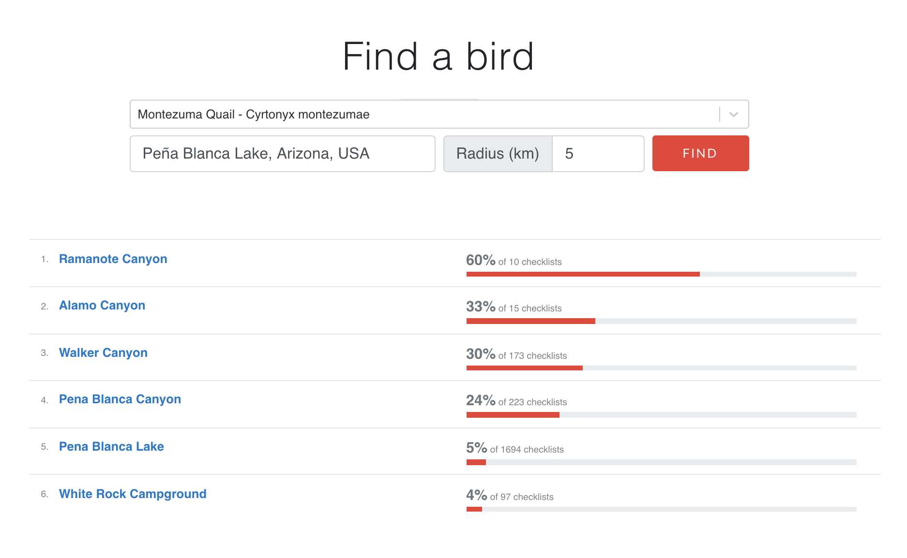

## Bird Finder
This is a little project I put together using React and PHP (Codeigniter framework). [eBird.org](ebird.org) doesn't currently provide a good way show hotspots in an area with the greatest probability of seeing a target bird. This tool attempts to address that. Unfortunately, eBird's API doesn't currently support retrieving the data this way, so I'm doing some creative fetching of resources outside of their API. This contributes to the tool being slower than expected because every hotspot that is analyzed requires a CSV file to be fetched from eBird servers. As a result, don't overuse this tool as it may cause undue strain on eBird servers if large areas with many hotspots are being analyzed. 

The tool can be used at: [http://birding.rawcomposition.com](http://birding.rawcomposition.com)

## Contributing
Feel free to open a pull request if you have a feature you would like to add. There's a few features I would like to add at some point to make it more useful.

### To Do
- Refresh cache after 30 days (currently hotspots are cached indefinitely)
- Determine appropriate limits for how many hotspots can be processed and throw appropriate errors
- Update URL with query parameters so links to specific results can be shared easily
